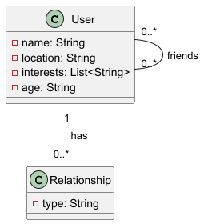
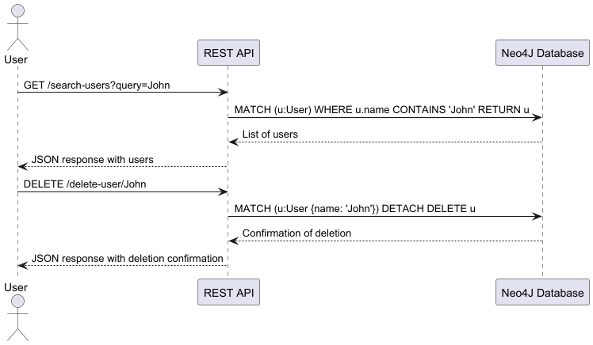

# Projekt PDwCO

## Opis projektu

Ten projekt to proof of concept aplikacji wykorzystującej grafową bazę danych Neo4J. Aplikacja została stworzona z użyciem technologii RESTful API oraz React jako frameworka frontendowego. Projekt został wdrożony w chmurze Heroku.

## Technologie

- **Język programowania:** JavaScript
- **Backend:** Node.js, Express.js
- **Frontend:** React
- **Baza danych:** Neo4J
- **Środowisko chmurowe:** Heroku

## Funkcjonalności

1. **Dodawanie użytkownika:** Użytkownik może dodać nowego użytkownika do bazy danych.
2. **Usuwanie użytkownika:** Użytkownik może usunąć użytkownika z bazy danych.
3. **Dodawanie znajomości:** Użytkownik może dodać znajomość między dwoma użytkownikami.
4. **Usuwanie znajomości:** Użytkownik może usunąć znajomość między dwoma użytkownikami.
5. **Znajdowanie wspólnych znajomych:** Użytkownik może znaleźć wspólnych znajomych między dwoma użytkownikami.
6. **Znajdowanie wspólnych zainteresowań:** Użytkownik może znaleźć wspólne zainteresowania między dwoma użytkownikami.
7. **Znajdowanie najkrótszej ścieżki:** Użytkownik może znaleźć najkrótszą ścieżkę znajomości między dwoma użytkownikami.
8. **Znajdowanie osoby:** Użytkownik może znaleźć osobę o podanym imieniu i nazwisku.
9. **Znajdowanie relacji:** Użytkownik może znaleźć relacje między dwoma użytkownikami.
10. **Listowanie użytkowników:** Użytkownik może wylistować wszystkich użytkowników w bazie danych.
11. **Listowanie znajomości:** Użytkownik może wylistować wszystkie znajomości w bazie danych.
## Diagramy UML

### Diagram klas



### Diagram sekwencji



## Wdrożenie

Aplikacja została wdrożona na platformie Heroku. Aby uruchomić aplikację lokalnie, należy wykonać następujące kroki:

1. Sklonować repozytorium:
    ```sh
    git clone <link_do_repozytorium>
    ```
2. Zainstalować zależności:
    ```sh
    npm install
    ```
3. Uruchomić serwer:
    ```sh
    npm start
    ```
   
Aby wdorzyć aplikację na platformie Heroku, należy wykonać następujące kroki:

1. Zainstalować Heroku CLI:
    ```sh
    npm install -g heroku
    ```
2. Zalogować się do Heroku:
    ```sh
    heroku login
    ```
   
3. Stworzyć nową aplikację:
    ```sh
    heroku create
    ```
   
4. Wdrożyć aplikację:
    ```sh
    git push heroku master
    ```
   
5. Otworzyć aplikację w przeglądarce:
    ```sh
    heroku open
    ```

Aplikacja będzie dostępna pod adresem `https://nazwa-aplikacji.herokuapp.com/`.

## Link do działającej aplikacji

[Aplikacja na Heroku](https://mysterious-earth-91221-3b97fa374084.herokuapp.com/)

## Podsumowanie

Projekt "ChmuryObliczeniowe" spełnia wszystkie wymagania określone w zadaniu. Aplikacja wykorzystuje grafową bazę danych Neo4J, jest wdrożona w chmurze Heroku i posiada interfejs RESTful API. Dokumentacja zawiera odpowiednie diagramy UML oraz krótki opis wdrożenia.